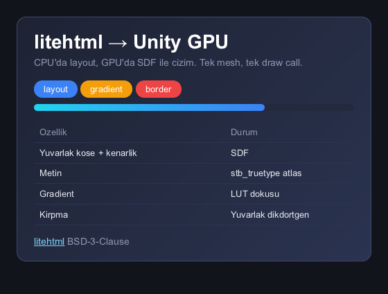

# Doctype

HTML and CSS as a game UI for Unity, laid out by
[litehtml](https://github.com/litehtml/litehtml) and drawn entirely on the GPU.
No embedded browser, no CPU rasterizer, no per-platform web view — one mesh, one
draw call, and it compiles everywhere Unity does, iOS and Android included.

<p align="center">
  
</p>

---

## Why this exists

The usual ways to get HTML into a game engine all embed a browser: Ultralight,
CEF, a platform web view. That buys fidelity and costs you the mobile platforms,
the binary size, and a rasterizer you cannot see into.

litehtml is a different kind of dependency. It is plain C++, it has no renderer
at all, and it does not draw a single pixel. It parses HTML and CSS, runs layout,
and then calls *you* through a `document_container` interface: fill this
rectangle, put this glyph here, stroke this border, paint this gradient.

This project is the other half of that interface. It turns those calls into a
flat stream of quads with the shape parameters baked into their vertices, hands
the whole page to the GPU as one mesh, and reconstructs rounded corners, borders,
gradients and glyph coverage analytically in a fragment shader. What comes out is
a `RenderTexture` you can put anywhere Unity accepts one — a `RawImage`, a
world-space quad, a material slot on a monitor prop.

## What works

- **CSS you would actually use.** Flexbox, floats, tables, `position:
  absolute/fixed`, `overflow:auto` with real scrolling, `vw`/`vh`/`%` units,
  border radius, linear/radial/conic gradients, images, web-safe and embedded
  fonts.
- **Interaction.** `:hover` and `:active`, anchor clicks, element clicks by id,
  scrolling, and dragging — including dragging an item **from one surface onto
  another**, which is what lets a HUD be several independent panels instead of
  one screen-sized sheet.
- **Mutation without re-parsing.** `SetText` and `SetStyle` change a text node or
  an inline style in place. Re-parsing a document is ~11 ms on a budget phone;
  these are ~0.2 ms, and they keep hover, focus and scroll state that a re-parse
  would throw away.
- **Transparency that composites correctly.** A page can be a HUD over a running
  game, with a premultiplied-alpha material and touch pass-through so the parts
  it does not paint are not a sheet of glass over the game.
- **Platforms.** macOS, Android (arm64), iOS. Editor and player, built-in
  pipeline / URP / HDRP — the renderer issues its own `CommandBuffer` against an
  explicit target, so it does not care.

## How it fits together

```
Unity C# (managed)                     Native plugin (C++)

HtmlView          ── HTML/CSS ──▶  litehtml: parse, cascade, layout
  │                                      │
  │                                      ▼
  │                                    lhu_container: records draw calls
  │                                    as an analytic quad stream
  │                                      │
  │                   ◀── quads ─────────┘   (retained; only dirty subtrees
  │                                           are re-recorded)
  ▼
HtmlMeshBuilder   one quad → 4 vertices, shape params in 8 UV channels
  ▼
HtmlRenderer      one CommandBuffer, one DrawMesh, into a RenderTexture
  ▼
HtmlRawImage      composites it on a Canvas, forwards pointer input back
```

Nothing is rasterized on the CPU except glyph coverage, which is cached in an
atlas and uploaded once.

## Getting started

```bash
git clone https://github.com/DilaverSerif/doctype-unity
cd doctype-unity
Native/build_macos.sh          # or build_android.sh / build_ios.sh
```

Open the project in Unity 6000.5+ and load
`Assets/Doctype/Samples/HtmlDemo.unity`.

In code:

```csharp
var view = gameObject.AddComponent<HtmlView>();
view.LoadHtml("<body style='font-family:sans-serif'><h1>Merhaba</h1></body>");
// view.Texture is a RenderTexture

view.SetText("#score", "1280");                       // no re-parse
view.SetStyle("#slot3", "border-color:#3b82f6");      // no re-parse
string id = view.ElementAt(pointInCssPixels);          // pure query, no hover change
```

The package README under [`Assets/Doctype/`](Assets/Doctype/README.md)
covers fonts, resources, HUD layout and the input model in more depth.

---

## Measurements

This is the part that shaped the design, so it gets the space.

Everything below was measured on a **Xiaomi 22101316I at 1080×2400** — a budget
Android phone, deliberately — with a spinning-cube load running underneath, 300
frames per scenario, Vulkan, frame pacing off, GPU times from
`FrameTimingManager`. The harness is in the repo
([`HtmlBenchmark.cs`](Assets/Doctype/Samples/HtmlBenchmark.cs));
build it with `Tools/Doctype/Build Benchmark APK` and it writes a CSV to the
device.

Each panel is a quarter of the screen holding a scrollable list — 383 quads, the
size of a real HUD panel.

| scenario | quads | CPU ms/frame | GPU ms | vertex KB/frame |
|---|---|---|---|---|
| no HUD at all | 0 | 0.00 | 2.48 | 0 |
| HUD up, nothing changing | 381 | **0.00** | **3.14** | **0** |
| four HUDs up, nothing changing | 1524 | **0.00** | **4.58** | **0** |
| one text node changed per frame | 383 | 1.90 | 21.09 | 224 |
| one inline style changed per frame | 383 | 1.85 | 21.09 | 217 |
| scrolled every frame | 410 | 1.11 | 21.58 | 240 |
| resized every frame | 412 | 4.45 | 21.77 | 241 |
| re-parsed every frame | 384 | 12.51 | 21.06 | 225 |
| four panels, one text node each | 1532 | 6.80 | 31.81 | 3591 |

### A HUD that is not changing is free

Zero CPU, zero bytes uploaded, and 0.4 ms of GPU for four panels and 1524 quads.
That is not a rounding artifact — the view skips layout, recording, mesh build
and draw entirely when nothing has invalidated it, so an idle page costs one
`if`. For UI that updates a few times a second, the work is already done.

### The cost is pixels, not geometry

Everything that redraws lands between 21 and 22 ms of GPU, whether the frame did
1.1 ms of CPU work or 12.5 ms, and whether it re-parsed the document or moved one
character. That plateau is the whole story, and it took a controlled experiment
to read correctly:

| | quads | vertex bytes | pixels | GPU |
|---|---|---|---|---|
| full resolution | 383 | 224 KB | 1× | 21.09 ms |
| half resolution | **383** | **224 KB** | **¼** | **8.14 ms** |

Same document, same quad count, the same 224 KB uploaded — only the pixel count
changed, and the cost fell by 3.3×. So the GPU time is fill and overdraw: the
page paints its panel background, then a rectangle per row, then a border, then
the glyphs, and every one of those fragments is shaded by an SDF shader with an
antialiasing skirt.

The numbers above already include one consequence of that reading: the exact
sRGB transfer function used to run per fragment, ahead of every branch, on a
colour the mesh writes once per quad. Moving it to the vertex stage — identical
output, four corners carrying one value interpolate to that value — took a
consistent **14% off every redraw scenario** (24.4 → 21.1 ms on one panel,
36.3 → 31.8 on four). One `pow` per channel, measured at three milliseconds a
frame on this phone.

Two things follow. The 3.6 MB of vertex data a four-panel HUD re-uploads every
frame is **not** the bottleneck — it costs CPU time (~3 ms of mesh building) and
nothing measurable on the GPU. And `RenderScale`, which exists on
`HtmlRawImage`, turns out to be a shipping-grade optimisation and not just a
measurement knob: half resolution, 3.5× cheaper, softer text.

### Re-parsing is the expensive thing, so don't

Rebuilding a document from a string costs 12.5 ms, of which **10.9 ms is
parsing** — and most of that is litehtml re-parsing its own default stylesheet,
a fixed price per document regardless of page size. Two things take it off the
table: a trimmed master stylesheet for game UI (~2.4× faster document creation),
and a check that skips the parse entirely when the markup is byte-identical to
what is already loaded. Which is why the API pushes you toward `SetText` and
`SetStyle` instead.

---

## What measuring actually found

Every one of these was invisible until something measured it, and several were
bugs in the measurement itself. They are worth listing because they are the
argument for having a benchmark at all.

**`vw`/`vh` were frozen at parse time.** litehtml resolves viewport units when it
*computes* styles, against a media snapshot taken once. A host sets the viewport
after loading the page — the surface only learns its size a frame later — so
every viewport-relative length answered for a size the page was never displayed
at. A 4-column grid silently wrapped to 3.

**Fixing that broke scrolling.** The restyle initially rebuilt the render tree,
and a freshly created `scroll_view` reports nothing to scroll until a second
render has measured its content. The page scrolled, moved zero pixels, and looked
like the touch was ignored. The fix was to stop rebuilding: `media_changed()`
already does it when a media query genuinely flips.

**Transparent meant white.** The surface composites with `Blend One
OneMinusSrcAlpha`, so colours must be premultiplied. The default clear was
`(1,1,1,0)` — white at zero alpha, which is not a valid premultiplied value and
adds white to everything behind wherever the page paints nothing. Invisible until
the first page with a genuinely empty region.

**A stats panel and a benchmark want opposite things.** `ParseMs`/`LayoutMs`/
`DrawMs` mean "the last time this ran", and they keep reporting it on every frame
where it did not. An idle HUD confidently reported 2.67 ms of parsing per frame.
The view now also carries monotonic counters, and the benchmark divides
differences by frames rather than taking medians of a sticky value.

**Three benchmark scenarios were measuring nothing.** The style-churn row keyed
its colour off `frame & 1` while sweeping an even number of slots, so every slot
was revisited on the same parity and `SetStyle` kept answering "already that".
The resize row moved the rect by one canvas unit, which rounds away to nothing on
a small screen. The scroll row aimed at a point that landed on the header. All
three reported clean numbers for work that never happened.

**The benchmark's panels were slivers.** Their parent `RectTransform` was left at
its default zero size, so four "quarter-screen" panels became four slivers around
the canvas centre — and every number was about a HUD nobody would ship.

**The frame-time column was lying twice.** Unity paces frames to a whole divisor
of the refresh rate, so a run that misses 16.7 ms once locks to 30 fps and every
scenario cheaper than 33 ms reports 33 ms. And with 240 cubes the baseline was
already GPU-bound, so the HUD had a 33 ms shadow to hide in. The benchmark now
turns pacing off, uses an unclamped clock, and flags per row when work was
measured that the frame time did not move for.

**`FrameTimingManager` returns nothing unless you ask.** `enableFrameTimingStats`
is a Player Setting and defaults to off, on every platform and every graphics
API. The GPU column read "n/a" from top to bottom, which looks exactly like a
device refusing to answer.

---

## Testing

```bash
Native/build_macos.sh harness        # 79 checks, no Unity and no GPU
Native/build/macos/bin/lhu_verify_quadcache   # 693 frame comparisons
Native/bench_android.sh              # CPU benchmark on a real phone, no Unity
```

Play-mode tests (34) live in `Assets/Doctype/Tests/` and run through
Unity's test runner. The native harness rasterizes pages through a reference
software rasterizer, so the quad stream can be checked against known pixels
without a GPU in the loop.

## Status

Working and measured, not yet a released package. The interfaces described above
are stable enough to build on; the roadmap is about cost, not correctness:
reducing fill and overdraw, redrawing only what changed, and separating layout
cost from document size.

## Licence and credits

This project is MIT licensed — see [LICENSE](LICENSE).

It vendors patched copies of third-party code under `Native/third_party/`, each
under its own licence — see [THIRD-PARTY-NOTICES.md](THIRD-PARTY-NOTICES.md):

| | | |
|---|---|---|
| [litehtml](https://github.com/litehtml/litehtml) | BSD-3-Clause | HTML/CSS parsing and layout |
| gumbo | Apache-2.0 | HTML5 parser, bundled with litehtml |
| stb_truetype | public domain | glyph rasterization |

litehtml is pinned and carries local patches — performance fixes, a text-mutation
entry point, and hooks the retained quad cache needs. Every patch is marked
`LHU PATCH` in the source and explained where it sits;
[`Native/third_party/VENDORING.md`](Native/third_party/VENDORING.md) says how to
update against upstream.
